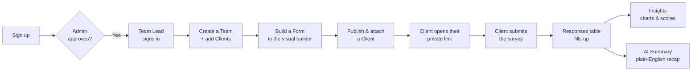
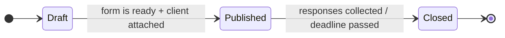

<div align="center">

# 🪶 OptiPhoenix — Client Survey Tool

**Design a survey, send it to a client, watch the feedback roll in — then let AI summarise it for you.**

A workspace for delivery teams to collect structured client feedback: build forms visually, share a single secure link per client, and turn raw responses into charts and plain-English summaries.


</div>

---

## ✨ What you can do

| | Feature | In short |
|---|---|---|
| 🧩 | **Visual form builder** | Drag‑and‑drop questions, sections, branching logic, and 13 question types (rating, yes/no, dropdown, resource rating, date/time, free text…). |
| 👥 | **Teams & clients** | Group work into teams, add client organisations, and invite teammates with view / write / full access. |
| 🔗 | **One link per client** | Every client gets a unique, private survey URL — no logins, no accounts, no shared links. |
| 📥 | **Response collection** | Submissions stream into a sortable, filterable, exportable table (Excel / PDF). |
| 📊 | **Insights** | Auto‑generated charts and score breakdowns per client and time period. |
| 🤖 | **AI summary** | One click turns a pile of responses into a short, readable narrative of what clients are saying. |
| 📨 | **Email notifications** | Account approvals, team invites, and survey events go out automatically. |
| 🌗 | **Light & dark** | Full theme support, keyboard‑friendly, responsive down to mobile. |
| 📁 | **Templates** | Save any form as a reusable template and share it with your team. |

---

## 👤 Who uses it

| Role | What they do |
|---|---|
| **Admin** | Approves new sign‑ups, manages all users and teams, sees the whole organisation at a glance. |
| **Team Lead** | Builds forms, manages their clients, sends surveys, reads the responses and insights. |
| **Client** *(no account)* | Opens their private link and fills in the survey. That's it. |

---

## 🔄 How the app works



### The life of one survey



---

## 🚀 Run it locally

### 1. Prerequisites

| Tool | Notes |
|---|---|
| **Node.js 20+** | Use `nvm` if you have it. |
| **MySQL 8** | Local via **XAMPP** or **MAMP** — full walkthrough in [`docs/MYSQL_SETUP.md`](docs/MYSQL_SETUP.md). No Xcode required. |

### 2. Install & configure

```bash
# clone, then from the project folder:
npm install
cp .env.example .env
```

Open `.env` and set at minimum:

| Variable | What it's for |
|---|---|
| `DATABASE_URL` | Your local MySQL connection string (see `.env.example`). |
| `AUTH_SECRET` | Any long random string — `openssl rand -base64 32`. |
| `AUTH_URL` | `http://localhost:3000` for local. |
| `GEMINI_API_KEY` | *Optional* — enables the AI summary feature ([get a free key](https://aistudio.google.com/apikey)). |
| `RESEND_API_KEY` | *Optional* — enables outgoing email ([resend.com](https://resend.com)). |

### 3. Set up the database

```bash
npm run db:migrate     # create the tables
npm run db:seed        # add demo users, a team, clients, and sample responses
```

### 4. Start the app

```bash
npm run dev
```

Open **[http://localhost:3000](http://localhost:3000)**.

### 5. Sign in with the demo accounts

| Role | Email | Password |
|---|---|---|
| Admin | `admin@optiphoenix.local` | `Admin123!` |
| Team Lead | `lead@optiphoenix.local` | `Lead123!` |

> New sign‑ups start as **Pending** and wait on the sidebar in Admin → **Users** for approval.

---

## 🧭 Where things live

| Area | Route | Purpose |
|---|---|---|
| Dashboard | `/dashboard` | Role‑aware overview: KPIs, response trend, recent activity. |
| Teams | `/dashboard/teams` | Workspaces, members, and invites. |
| Clients | `/dashboard/clients` | Client organisations and their resources. |
| Forms | `/dashboard/forms` | Form library + the visual builder. |
| Templates | `/dashboard/templates` | Reusable form blueprints. |
| Responses | `/dashboard/responses` | Every submission, filterable and exportable. |
| Insights | `/dashboard/insights` | Charts and score breakdowns. |
| AI Summary | `/dashboard/summarize` | Generated narrative of client feedback. |
| Users | `/dashboard/users` | *(Admin)* Approvals and account management. |
| Survey | `/survey/[token]` | The public, no‑login page a client fills in. |

---

## 🛠️ Command reference

| Command | What it does |
|---|---|
| `npm run dev` | Start the development server (hot reload). |
| `npm run build` | Production build. |
| `npm run start` | Serve the production build. |
| `npm run lint` | Lint the codebase. |
| `npm run db:migrate` | Apply schema changes to your database. |
| `npm run db:seed` | Load demo data. |
| `npm run db:studio` | Open Prisma Studio — a visual database browser (port 5555). |
| `npm run db:generate` | Regenerate the database client after a schema change. |

---

## 🧱 Built with

Next.js (App Router) · React 19 · TypeScript · Tailwind CSS 4 · Prisma ORM · MySQL · Auth.js · Zod · Resend (email) · Google Gemini (AI summary) · `@dnd-kit` (drag‑and‑drop) · SheetJS & jsPDF (exports).

---

## 📖 Product guide

A visual, presentation‑ready walkthrough lives in **[`docs/OptiPhoenix-Product-Guide.pdf`](docs/OptiPhoenix-Product-Guide.pdf)** — good for demos and onboarding.

---

<div align="center">
<sub>OptiPhoenix Client Survey Tool · internal project</sub>
</div>
